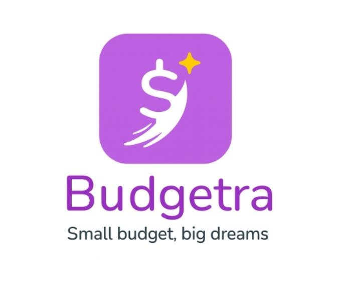

## "

I’m a software developer and open-source enthusiast. 

- 🌱 I’m currently learning: NoSql , Typescript 
- 📫 How to reach me: jayamsrivastava99@gmail.com

---

### Languages  

 Python&nbsp;&nbsp;
 JavaScript&nbsp;&nbsp;
 TypeScript&nbsp;&nbsp;
 SQL&nbsp;&nbsp;
 React&nbsp;&nbsp;
 Node.js&nbsp;&nbsp;
 HTML&nbsp;&nbsp;
 CSS

### Tools 

 Git&nbsp;&nbsp;
 Docker&nbsp;&nbsp;
 Firebase&nbsp;&nbsp;
 Kubernetes

---

### Featured Projects

-  Budgetra — This project aims to provide students better management of their expenses and keep track of it  · [repo](https://github.com/hrx01-dev/BUDGETRA)
- Mediinsight — This app is designed especially for Older  people to keep track of their medication , give them reminders , have an on device LLM works offline , Contain an OCR system which is used to identify the mdeicine  · [repo](https://github.com/hrx01-dev/MediInsight)
- VeritasAI — This project is designed to prevent misinformation. It includes features like deepfake detection, authenticated website and URL checks, and text content analysis. It also provides a comprehensive analysis report and sets up a community where users can openly discuss misinformation. · [repo](https://github.com/hrx01-dev/VeritasAI)

### Stats

  

---

### Contact

- Email: jayamsrivastava99@gmail.com

- LinkedIn: [Jayam Srivastava](https://www.linkedin.com/in/jayam-srivastava-519aa8377?utm_source=share&utm_campaign=share_via&utm_content=profile&utm_medium=android_app)

---

