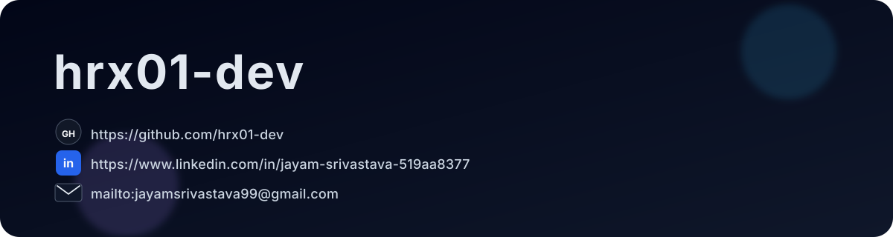

  

## 

I’m a software developer and open-source enthusiast.

- 🔭 I’m currently building practical web projects, improving my frontend and backend skills, and using TypeScript and NoSQL more effectively.

---

### Languages  

   &nbsp;&nbsp;
   &nbsp;&nbsp;
   &nbsp;&nbsp;
   &nbsp;&nbsp;
   &nbsp;&nbsp;
   &nbsp;&nbsp;
   &nbsp;&nbsp;
  

### Tools 

   &nbsp;&nbsp;
   &nbsp;&nbsp;
   &nbsp;&nbsp;
  

---

### Featured Projects

- Budgetra — A student-focused expense manager for tracking spending and improving financial habits. · [Checkout](https://github.com/hrx01-dev/BUDGETRA)
- MediInsight — A medication companion for older adults with reminders, offline on-device LLM support, and OCR-based medicine identification. · [Checkout](https://github.com/hrx01-dev/MediInsight)
- VeritasAI — A misinformation defense platform with deepfake detection, website/URL authenticity checks, text analysis, and community-led discussion. · [Checkout](https://github.com/hrx01-dev/VeritasAI)

### GitHub Profile Stats

  

  
  

  
  

  

---

### Contact

-  https://github.com/hrx01-dev
-  https://www.linkedin.com/in/jayam-srivastava-519aa8377
-  mailto:jayamsrivastava99@gmail.com

---
